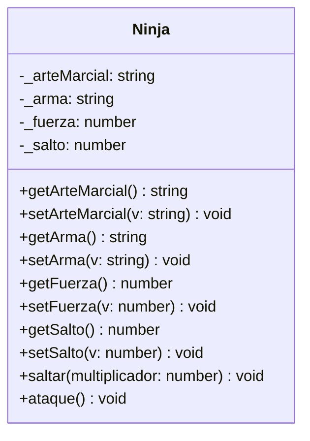

# 01EJ07 — Diagrama de clases UML

```mermaid
classDiagram
    class Ninja {
        -_arteMarcial: string
        -_arma: string
        -_fuerza: number
        -_salto: number
        +getArteMarcial() string
        +setArteMarcial(v: string) void
        +getArma() string
        +setArma(v: string) void
        +getFuerza() number
        +setFuerza(v: number) void
        +getSalto() number
        +setSalto(v: number) void
        +saltar(multiplicador: number) void
        +ataque() void
    }
```

> SRP: se mantiene la impresión dentro de la clase porque la consigna lo solicita expresamente.
